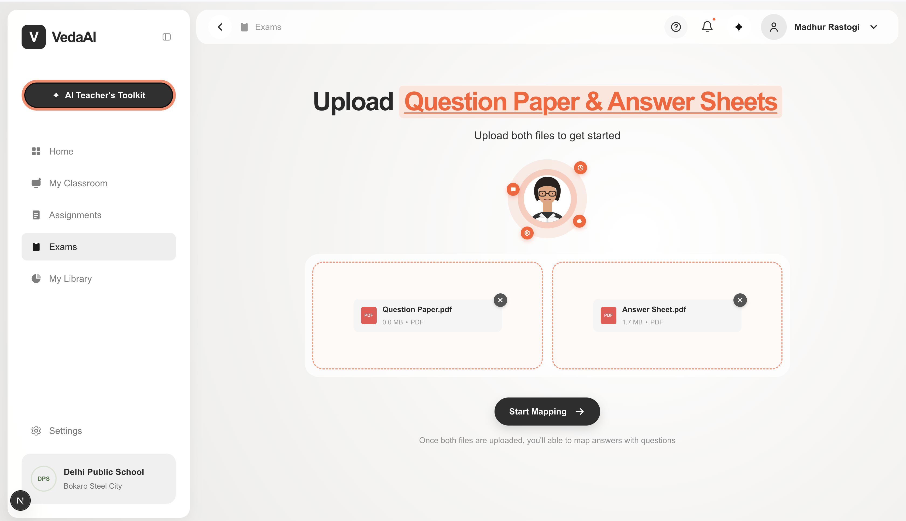
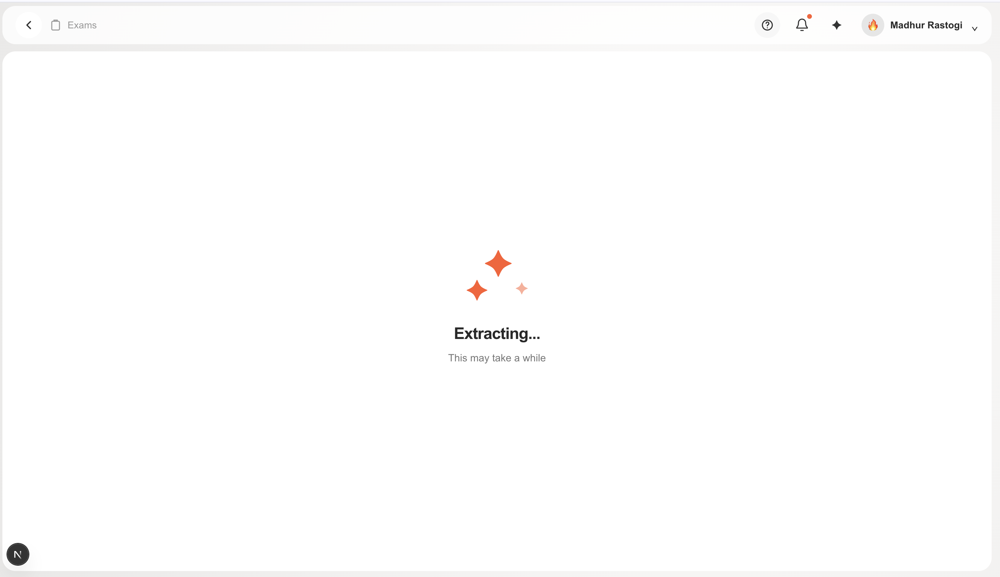

# VedaAI — Assessment Extraction and Answer Mapping

An AI powered assessment analysis application that helps teachers understand a student's handwritten answer sheet. It automatically extracts questions, identifies the matching answers, evaluates each response and highlights the exact answer location on the student's answer sheet.

The workflow is simple. Upload the question paper and the student's answer sheet, start the analysis, review the extracted questions and scores, then select any question to instantly locate the matching answer on the answer sheet.

## Screenshots

### Homepage


### Upload Files


### Loading State


### Question Paper Sample


### Student Answer Sheet Sample


### Extracted Questions and Marks


### Answer Region Highlighting


## Table of Contents

1. [Project Overview](#project-overview)
2. [Core Objective](#core-objective)
3. [Core Workflow](#core-workflow)
4. [Key Features](#key-features)
5. [Technology Stack](#technology-stack)
6. [AI Approach](#ai-approach)
7. [Question Extraction Logic](#question-extraction-logic)
8. [Answer Mapping Logic](#answer-mapping-logic)
9. [Answer Status](#answer-status)
10. [Region Detection](#region-detection)
11. [Frontend Interaction](#frontend-interaction)
12. [PDF Viewer](#pdf-viewer)
13. [Test Dataset](#test-dataset)
14. [Test Scenarios](#test-scenarios)
15. [Business Logic](#business-logic)
16. [Cost Aware Design](#cost-aware-design)
17. [Why Next.js](#why-nextjs)
18. [Why No Database](#why-no-database)
19. [Security Considerations](#security-considerations)
20. [File Validation](#file-validation)
21. [Error Handling](#error-handling)
22. [API Response Structure](#api-response-structure)
23. [Example Question Object](#example-question-object)
24. [Project Structure](#project-structure)
25. [Local Setup](#local-setup)

## Project Overview

Teachers often need to manually compare a printed question paper with a student's handwritten answer sheet. This becomes difficult when:

1. The student answers questions in a different order
2. Some questions are not attempted
3. Questions contain labelled sub parts
4. Answers continue across multiple pages
5. The answer sheet contains handwritten content
6. The answer sheet contains unrelated or unmatched answers
7. The teacher needs to quickly locate a particular answer

This project automates the workflow using AI based document understanding. The application accepts a question paper and one student's answer sheet as input, then performs four main operations:

**Question Extraction** — extracting every question from the question paper while preserving the original numbering and order

**Answer Extraction** — reading and understanding the student's handwritten answers

**Answer Mapping** — matching each answer to the correct question even when answers are written out of order

**Grading and Feedback** — evaluating the answer, calculating marks and providing concise feedback

The final interface lets the teacher select a question and immediately see where that answer appears on the student's answer sheet.

## Core Objective

The main objective is to reduce the amount of manual work a teacher does while reviewing an assessment. The intended experience is:

Upload question paper → Upload answer sheet → Start analysis → Review extracted questions → Review marks and feedback → Select a question → Automatically navigate to the relevant answer page → Highlight the exact answer region

The teacher should be able to see which questions were answered, where the answers are located and which questions were left unanswered, without manually searching through the complete answer sheet.

## Core Workflow

```
Question Paper
      ↓
Gemini document analysis
      ↓
Question Extraction
      ↓
Structured Question Data
      ↓
Student Answer Sheet
      ↓
Gemini document and handwriting analysis
      ↓
Answer Extraction
      ↓
Question and Answer Mapping
      ↓
Answer Region Detection
      ↓
Grading
      ↓
Teacher Review Interface
```

## Key Features

### Question Extraction

* Extracts every question from the uploaded question paper
* Preserves the original printed order and numbering
* Treats labelled sub parts as independent questions, for example 3(a) and 3(b) become two separate question objects
* Supports common question formats such as `1.`, `1)`, `Q1`, `Q.1`, `3(a)`, `3 (a)`, `3(i)`, `3(ii)`

### Answer Extraction

Analyzes the student's answer sheet and identifies handwritten responses. The model transcribes each answer into structured text while preserving the relationship between the handwritten response and its physical location in the document.

### Answer Mapping

The student does not need to answer questions in the same order as the question paper. Gemini analyzes the complete answer sheet and maps each detected response to the most appropriate extracted question, even when the order looks like Question 1, Question 4, Question 2, Question 6, Question 3.

### Unanswered Questions

If a question has no corresponding answer, it is marked unanswered and receives a score of zero. No answer region is generated, which prevents the interface from incorrectly highlighting unrelated handwritten content.

### Answer Region Highlighting

For answered questions, Gemini returns the approximate physical location of the answer on the answer sheet using normalized coordinates from 0 to 1000, where x is the horizontal position, y is the vertical position, and width and height define the region size. The frontend converts these into percentage based positions so the highlight stays correctly placed at any PDF zoom level.

### Multi Page Answers

The data model supports multiple answer regions for a single question, so an answer can continue from one page to another. The viewer displays the relevant region as the teacher moves through pages.

### Grading

Each question includes maximum marks, obtained marks, answer status, extracted answer text and teacher facing feedback. The score is constrained so it can never exceed the maximum marks assigned to the question.

### Unmatched Answers

The backend also supports answers that cannot be confidently matched to any extracted question. Rather than forcing an uncertain answer into an existing question, it is returned as an unmatched answer with its page and physical region, since an incorrect mapping is worse than an honest "not sure."

## Technology Stack

**Frontend**
* Next.js
* React
* TypeScript
* Tailwind CSS

**Document Rendering**
* PDF.js, used to render the student's answer sheet with page navigation, zooming and thumbnail navigation

**Artificial Intelligence**
* Google Gemini, model Gemini 3.6 Flash
* Used for question extraction, handwritten answer understanding, question and answer mapping, answer evaluation, score generation, feedback generation and answer region detection

**Backend**
* Next.js API Routes, so the application does not require a separate backend service

**Storage**
* No database is required for the current assignment. Uploaded files are processed during the current application session, and the assignment explicitly allows in memory storage without authentication or persistent storage.

## AI Approach

Gemini handles document understanding because the input documents cannot be assumed to always contain machine readable text. A question paper can be a normal digital PDF, a scanned PDF, a PDF containing images, or a JPG, PNG or WebP image. A student's answer sheet can contain handwritten content that cannot be reliably processed using traditional text extraction alone. The current implementation therefore uses Gemini's vision based document analysis as the primary extraction approach, which keeps the application flexible across different document formats.

## Question Extraction Logic

The question extraction prompt instructs Gemini to:

* Preserve the original printed question order and numbering
* Extract every question
* Treat labelled sub parts separately without combining sub questions
* Ignore page numbers, examination instructions, school or college information and decorative content
* Avoid inventing questions
* Extract explicit marks when available, and default to two marks when a question does not specify marks
* Generate a stable identifier based on the question number, for example Question 1 becomes `q1`, Question 3(a) becomes `q3a`, and Question 3(b) becomes `q3b`

The result is returned using a structured JSON schema instead of free form text.

## Answer Mapping Logic

After question extraction, the extracted questions are provided to Gemini together with the student's answer sheet. Gemini analyzes the entire answer sheet rather than assuming answers appear in question order. For every question, the model determines whether it was attempted, which handwritten content belongs to it, the transcription, the score, the answer status, the answer region and the feedback. This is what allows the application to support out of order answers.

## Answer Status

Each question can have one of three statuses:

* **answered** — contains one or more answer regions
* **unanswered** — score of zero, no answer regions
* **unclear** — represents cases where the handwritten content or mapping cannot be confidently interpreted

## Region Detection

One of the most important requirements is highlighting the exact region of the answer sheet. The application does not use fixed coordinates. Instead, Gemini identifies the answer region dynamically, and the backend returns data similar to:

```json
{
  "page": 1,
  "x": 120,
  "y": 350,
  "width": 760,
  "height": 180
}
```

Coordinates are normalized between 0 and 1000, and the frontend converts them to percentages. For example, x of 120 becomes 12 percent, y of 350 becomes 35 percent, width of 760 becomes 76 percent, and height of 180 becomes 18 percent. This lets the highlight scale correctly with the rendered PDF page.

## Frontend Interaction

When the teacher selects a question:

1. The selected question is identified
2. Its answer regions are retrieved
3. The first relevant answer page is selected
4. The PDF viewer navigates to that page
5. Regions belonging to the current page are passed to the viewer
6. The answer region is highlighted

This creates a direct connection between the question list and the physical answer sheet.

## PDF Viewer

The custom PDF viewer is built with PDF.js and supports PDF rendering, page navigation, zoom, page count detection, page thumbnails, dynamic answer highlights and multiple answer regions. The highlight layer is positioned relative to the rendered PDF page, so the answer region moves together with the document when the teacher zooms in or out.

## Test Dataset

The assignment did not provide a fixed question paper and answer sheet for development testing, so a controlled test dataset was created for this project. It contains a six question question paper and a handwritten student answer sheet. The question paper includes standard questions and labelled question structures, and the answer sheet was handwritten manually and converted into a PDF, designed specifically to verify question extraction, question numbering and ordering, answer extraction, answer mapping, handwriting recognition, unanswered question detection, score generation, answer region detection, PDF page navigation and answer highlighting.

## Test Scenarios

**Scenario 1: Normal answered question**
A question has a clear handwritten answer. Expected result: the question is marked answered, the answer is extracted, marks are generated, and the answer region is detected and highlighted.

**Scenario 2: Unanswered question**
A question is intentionally left blank. Expected result: the question is marked unanswered, the score is zero, no answer text is returned, and no answer region is highlighted.

**Scenario 3: Out of order answers**
Answers are written in a different order from the question paper. Expected result: the AI maps each answer to the correct question number.

**Scenario 4: Labelled sub parts**
Questions contain labelled sub parts such as 3(a) and 3(b). Expected result: each sub part appears as an independent question.

**Scenario 5: Multiple pages**
An answer continues across multiple pages. Expected result: the question contains multiple answer regions corresponding to the different pages.

**Scenario 6: Unmatched content**
The answer sheet contains content that does not clearly belong to one of the extracted questions. Expected result: the system identifies the content as unmatched instead of incorrectly assigning it to another question.

## Business Logic

The product is built around reducing teacher effort. The teacher should not have to manually search the answer sheet for every question. Instead, the system connects the question list to the physical location of the student's answer:

```
Teacher selects Question 3(b)
      ↓
System identifies the mapped answer
      ↓
System identifies the answer page
      ↓
System navigates to that page
      ↓
System highlights the answer
```

This turns the answer sheet into an interactive document rather than a static PDF. The grading information adds another layer of value by letting the teacher quickly understand a student's performance without manually calculating every score.

## Cost Aware Design

AI based document processing can become expensive when every operation is sent to a model unnecessarily. This implementation keeps the architecture simple and avoids unnecessary infrastructure. It uses a single AI provider with structured responses, no database, no authentication system and no additional paid infrastructure.

For production, the architecture could be optimized further by introducing document classification before AI processing. For example, text based documents could use local text extraction, while scanned documents and handwritten answer sheets could use vision analysis. This would reserve vision based processing for documents that actually require it.

## Why Next.js

Next.js was chosen because it lets the frontend and backend API logic live inside one application. This assignment does not require a separate backend server, a database, authentication or complex deployment infrastructure. The API route handles document analysis while the React interface handles the teacher experience, which keeps the project easy to run, test and deploy.

## Why No Database

A database is not necessary for this assignment. The teacher uploads two documents and analyzes them during the current session, and the assignment explicitly states that in memory storage is sufficient. For a production version, persistent storage could support student records, assessment history, teacher accounts, previous evaluations, analytics and class level reporting.

## Security Considerations

The Gemini API key is stored in an environment variable and is never exposed in frontend code. The local environment file is excluded from Git through `.gitignore`. The project does not include authentication because it was not required by the assignment. A production deployment would need authentication, authorization, file size limits, file type validation, rate limiting, secure document storage, data retention policies and student data privacy controls.

## File Validation

The application validates uploaded files before sending them for analysis. Supported formats include PDF, JPEG, PNG, WebP, HEIC and HEIF. Invalid file types are rejected before processing, which keeps unsupported files out of the document analysis pipeline.

## Error Handling

The application includes validation and error handling for common failure cases, including a missing question paper, missing answer sheet, unsupported file type, missing Gemini API key, empty AI response, invalid AI response, no questions extracted, invalid PDF page number and PDF rendering errors. The API returns appropriate error responses so the frontend can display useful feedback to the teacher.

## API Response Structure

The analysis API returns structured information containing the question paper information, extracted questions, answer evaluation, answer status, score, feedback, answer regions, unmatched answers and answer sheet information. This structured response keeps the frontend independent from the raw AI response.

## Example Question Object

A processed question follows a structure similar to:

```json
{
  "id": "q3a",
  "number": "3(a)",
  "text": "Example question text",
  "maxMarks": 2,
  "score": 2,
  "status": "answered",
  "answerText": "Student answer",
  "feedback": "Correct answer",
  "answerRegions": [
    {
      "page": 1,
      "x": 120,
      "y": 350,
      "width": 760,
      "height": 180
    }
  ]
}
```

This structured representation lets the frontend display the question, score and answer location consistently.

## Project Structure

```
app/
  components/
  api/
    analyze/
  page.tsx
  globals.css
public/
  images/
    homepage.png
    uploadfiles.png
    loading.png
    questionpaper.png
    answersheetsample.png
    output1.png
    output2.png
package.json
next.config.ts
tsconfig.json
```

The main analysis endpoint is located at `app/api/analyze/route.ts`. The PDF viewer is implemented at `app/components/PdfViewer.tsx`. The main teacher interface is implemented in `app/page.tsx`.

## Local Setup

Clone the repository:

```bash
git clone https://github.com/Uday1017/vedaai-assessment.git
cd vedaai-assessment
```

Install dependencies:

```bash
npm install
```

Add your Gemini API key to a `.env.local` file:

```bash
GEMINI_API_KEY=your_api_key_here
```

Run the development server:

```bash
npm run dev
```

Open `http://localhost:3000` in your browser.