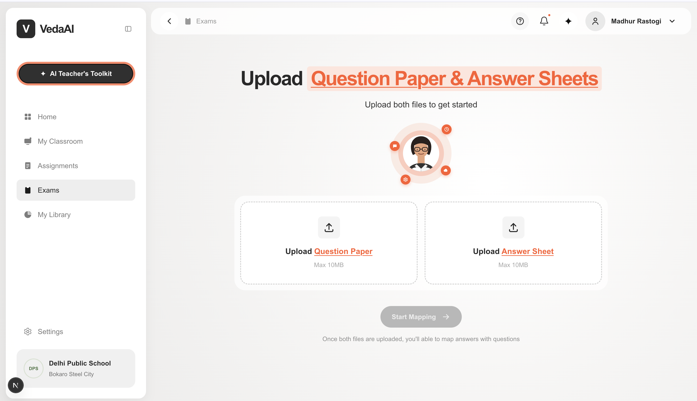
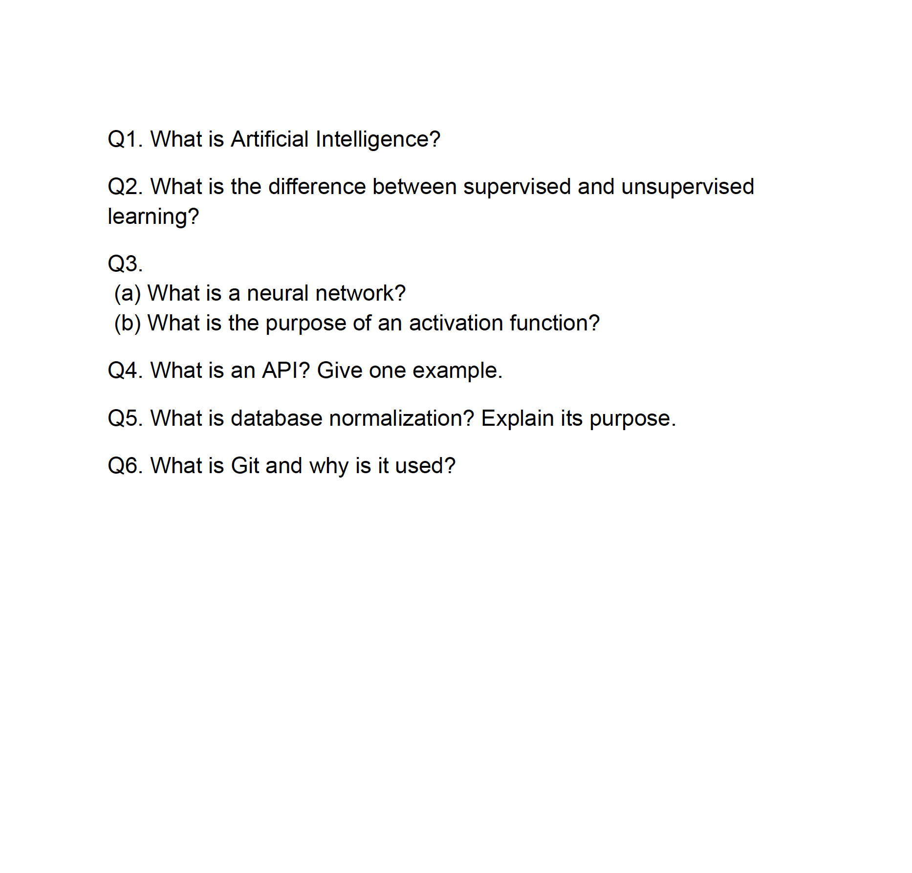
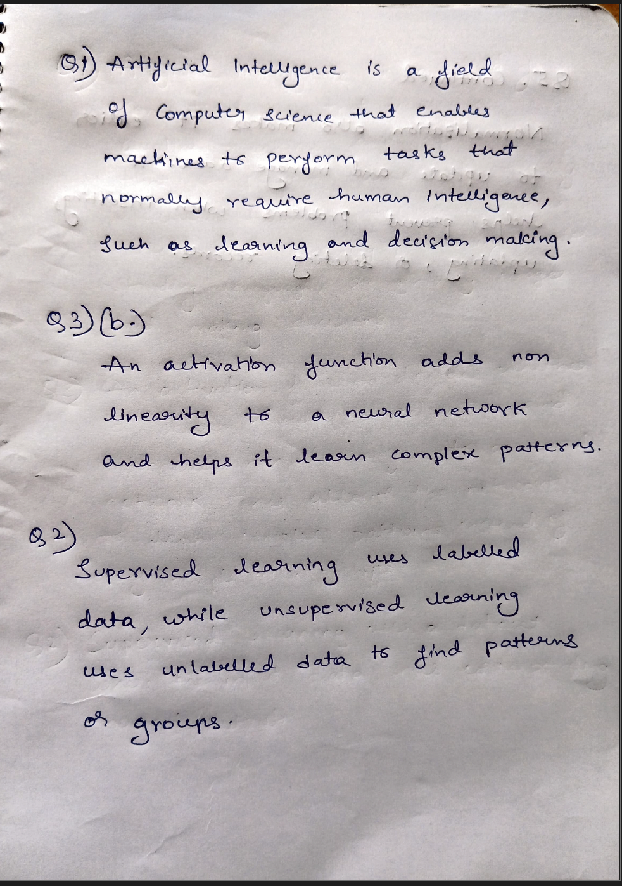
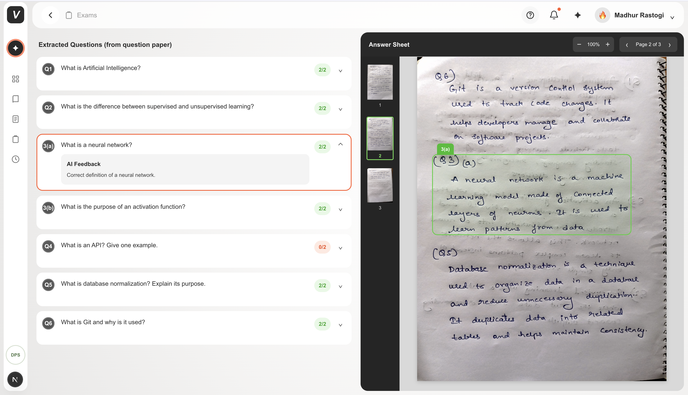
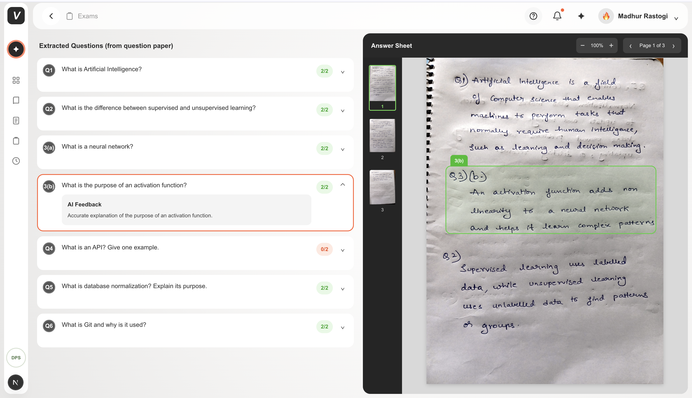

# VedaAI Assessment Extraction and Answer Mapping

An AI powered assessment analysis application that helps teachers understand a student's handwritten answer sheet by automatically extracting questions, identifying corresponding answers, evaluating responses and highlighting the exact answer location on the student's answer sheet.

The application is designed around a simple teacher workflow; upload the question paper and the student's answer sheet, start the analysis, review the extracted questions and scores, and select any question to immediately locate the corresponding answer on the answer sheet.

## 1. Project Overview

Teachers often need to manually compare a printed question paper with a student's handwritten answer sheet.

This becomes difficult when;

1. The student answers questions in a different order
2. Some questions are not attempted
3. Questions contain labelled sub parts
4. Answers continue across multiple pages
5. The answer sheet contains handwritten content
6. The answer sheet contains unrelated or unmatched answers
7. The teacher needs to quickly locate a particular answer

This project automates this workflow using AI based document understanding.

The application accepts a question paper and one student's answer sheet as input.

It then performs four main operations;

Question Extraction; extracting every question from the question paper while preserving the original numbering and order

Answer Extraction; reading and understanding the student's handwritten answers

Answer Mapping; matching each answer to the correct question even when answers are written out of order

Grading and Feedback; evaluating the answer, calculating marks and providing concise feedback

The final interface allows the teacher to select a question and immediately see where that answer appears on the student's answer sheet.

## 2. Core Objective

The main objective is to reduce the amount of manual work required from a teacher while reviewing an assessment.

The intended experience is;

Upload question paper

Upload answer sheet

Start analysis

Review extracted questions

Review marks and feedback

Select a question

Automatically navigate to the relevant answer page

Highlight the exact answer region

The teacher should be able to understand which questions were answered, where the answers are located and which questions were left unanswered without manually searching through the complete answer sheet.

## 3. Core Workflow

The application follows this pipeline;

Question Paper

↓

Gemini document analysis

↓

Question Extraction

↓

Structured Question Data

↓

Student Answer Sheet

↓

Gemini document and handwriting analysis

↓

Answer Extraction

↓

Question and Answer Mapping

↓

Answer Region Detection

↓

Grading

↓

Teacher Review Interface

## 4. Key Features

### Question extraction

The application extracts every question from the uploaded question paper.

The original printed order is preserved.

Original question numbering is preserved.

Labelled sub parts are treated as independent questions.

For example;

3(a)

3(b)

are represented as two separate question objects.

The extraction logic also supports common question formats such as;

1.

1)

Q1

Q.1

3(a)

3 (a)

3(i)

3(ii)

### Answer extraction

The application analyzes the student's answer sheet and identifies handwritten responses.

The model attempts to transcribe the answer into structured text while preserving the relationship between the handwritten response and its physical location in the document.

### Answer mapping

The student does not need to answer questions in the same order as the question paper.

The AI analyzes the complete answer sheet and maps each detected response to the most appropriate extracted question.

For example, the answer sheet can contain;

Question 1

Question 4

Question 2

Question 6

Question 3

The application still maps each answer to its corresponding question.

### Unanswered questions

If a question does not have a corresponding answer, it is marked as unanswered.

An unanswered question receives a score of zero.

No answer region is generated for an unanswered question.

This prevents the interface from incorrectly highlighting unrelated handwritten content.

### Answer region highlighting

For answered questions, Gemini returns the approximate physical location of the answer on the answer sheet.

The location is represented using normalized coordinates.

The coordinate system uses values from 0 to 1000;

x represents the horizontal position

y represents the vertical position

width represents the width of the answer region

height represents the height of the answer region

The frontend converts these normalized coordinates into percentage based positions.

This allows the highlight to remain correctly positioned when the teacher changes the PDF zoom level.

### Multi page answers

The data model supports multiple answer regions for a single question.

This allows an answer to continue from one page to another.

For example;

Question 6

Page 2; first answer region

Page 3; continuation region

The viewer can display the relevant region when the corresponding page is selected.

### Grading

The AI evaluates each answer against the corresponding question.

Each question contains;

Maximum marks

Obtained marks

Answer status

Extracted answer text

Teacher facing feedback

The score is constrained so that it cannot exceed the maximum marks assigned to the question.

### Unmatched answers

The backend also supports answers that cannot confidently be matched to any extracted question.

Instead of forcing an uncertain answer into an existing question, the answer can be returned as an unmatched answer with its page and physical region.

This is important because incorrectly mapping an answer is worse than identifying it as uncertain.

## 5. Technology Stack

### Frontend

Next.js

React

TypeScript

Tailwind CSS

### Document rendering

PDF.js

The PDF viewer is used to render the student's answer sheet inside the application.

It also supports page navigation, zooming and thumbnail based navigation.

### Artificial Intelligence

Google Gemini

Model; Gemini 3.6 Flash

Gemini is used for;

Question extraction

Handwritten answer understanding

Question and answer mapping

Answer evaluation

Score generation

Feedback generation

Answer region detection

### Backend

Next.js API Routes

The backend logic is implemented inside the Next.js application.

The application does not require a separate backend service.

### Storage

No database is required for the current assignment.

Uploaded files are processed during the current application session.

The assignment explicitly allows in memory storage and does not require authentication or persistent storage.

## 6. AI Approach

The application uses Gemini for document understanding because the input documents cannot be assumed to always contain machine readable text.

A question paper can be;

A normal digital PDF

A scanned PDF

A PDF containing images

A JPG image

A PNG image

A WebP image

Similarly, a student's answer sheet can contain handwritten content that cannot be reliably processed using traditional text extraction alone.

Therefore, the current implementation uses Gemini Vision based document analysis as the primary extraction approach.

This makes the application more flexible across different document formats.

## 7. Question Extraction Logic

The question extraction prompt instructs Gemini to;

Preserve the original printed question order

Preserve original numbering

Extract every question

Treat labelled sub parts separately

Avoid combining sub questions

Ignore page numbers

Ignore examination instructions

Ignore school or college information

Ignore decorative content

Avoid inventing questions

Extract explicit marks when available

Use two marks when the question does not specify marks

Generate a stable identifier based on the question number

Example;

Question 1 becomes q1

Question 2 becomes q2

Question 3(a) becomes q3a

Question 3(b) becomes q3b

The result is returned using a structured JSON schema instead of relying on free form text.

## 8. Answer Mapping Logic

After question extraction, the extracted questions are provided to Gemini together with the student's answer sheet.

Gemini is instructed to analyze the entire answer sheet rather than assuming that answers appear in question order.

For every question, the model determines;

Whether the question was attempted

Which handwritten content belongs to the question

The answer transcription

The score

The answer status

The answer region

The feedback

This allows the application to support out of order answers.

## 9. Answer Status

Each question can have one of three statuses;

answered

unanswered

unclear

An answered question contains one or more answer regions.

An unanswered question has a score of zero and no answer regions.

An unclear question allows the system to represent cases where the handwritten content or mapping cannot be confidently interpreted.

## 10. Region Detection

One of the most important requirements of the assignment is to highlight the exact region of the answer sheet.

The application does not use fixed coordinates.

Instead, Gemini identifies the answer region dynamically.

The backend returns data similar to;

{
"page": 1,
"x": 120,
"y": 350,
"width": 760,
"height": 180
}

The coordinates are normalized between 0 and 1000.

The frontend converts them to percentages.

For example;

x 120 becomes 12 percent

y 350 becomes 35 percent

width 760 becomes 76 percent

height 180 becomes 18 percent

This approach allows the highlight to scale with the rendered PDF page.

## 11. Frontend Interaction

When the teacher selects a question;

1. The selected question is identified
2. Its answer regions are retrieved
3. The first relevant answer page is selected
4. The PDF viewer navigates to that page
5. Regions belonging to the current page are passed to the viewer
6. The answer region is highlighted

This creates a direct connection between the question list and the physical answer sheet.

## 12. PDF Viewer

The custom PDF viewer is implemented using PDF.js.

The viewer supports;

PDF rendering

Page navigation

Zoom

Page count detection

Page thumbnails

Dynamic answer highlights

Multiple answer regions

The highlight layer is positioned relative to the rendered PDF page.

This is important because the answer region should move together with the document when the teacher zooms in or out.

## 13. Test Dataset

The assignment did not provide a fixed question paper and answer sheet for development testing.

Therefore, a controlled test dataset was created specifically for this project.

The dataset contains;

A six question question paper

A handwritten student answer sheet

The question paper includes standard questions and labelled question structures.

The answer sheet was intentionally created to test the important requirements mentioned in the assignment.

## 14. Dataset Design

The test question paper was created with six questions.

The questions were designed to test a combination of normal questions and assessment scenarios.

The student answer sheet was handwritten manually and converted into a PDF.

The test data was designed to verify;

Question extraction

Question numbering

Question ordering

Answer extraction

Answer mapping

Handwriting recognition

Unanswered question detection

Score generation

Answer region detection

PDF page navigation

Answer highlighting

## 15. Test Scenarios

### Scenario 1; Normal answered question

A question has a clear handwritten answer.

Expected result;

Question is marked answered

Answer is extracted

Marks are generated

Answer region is detected

Answer region is highlighted

### Scenario 2; Unanswered question

A question is intentionally left blank.

Expected result;

Question is marked unanswered

Score is zero

No answer text is returned

No answer region is highlighted

### Scenario 3; Out of order answers

Answers are written in a different order from the question paper.

Expected result;

The AI maps each answer to the correct question number.

### Scenario 4; Labelled sub parts

Questions contain labelled sub parts such as;

3(a)

3(b)

Expected result;

Each sub part appears as an independent question.

### Scenario 5; Multiple pages

An answer can continue across multiple pages.

Expected result;

The question contains multiple answer regions corresponding to the different pages.

### Scenario 6; Unmatched content

The answer sheet can contain content that does not clearly belong to one of the extracted questions.

Expected result;

The system can identify the content as unmatched instead of incorrectly assigning it to another question.

## 16. Screenshots

The project contains a dedicated `images` folder with screenshots showing the main application flow.

### Homepage

The initial application interface where the teacher can begin the assessment analysis.



### Upload Files

The teacher can upload the question paper and student answer sheet.


### Loading State

The application provides a processing state while the documents are being analyzed.


### Question Paper Sample

The test question paper used during development and validation.



### Student Answer Sheet Sample

The handwritten answer sheet used for testing answer extraction and mapping.



### Output 1

Example output showing the extracted questions, marks and answer mapping.



### Output 2

Example output showing the answer region highlighting and result interface.



## 17. Business Logic

The product is designed around reducing teacher effort.

The teacher should not have to manually search the answer sheet for every question.

Instead, the system creates a connection between the question list and the physical location of the student's answer.

For example;

Teacher selects Question 3(b)

↓

System identifies the mapped answer

↓

System identifies the answer page

↓

System navigates to that page

↓

System highlights the answer

This turns the answer sheet into an interactive document rather than a static PDF.

The grading information provides another layer of value by allowing the teacher to quickly understand the student's performance without manually calculating every score.

## 18. Cost Aware Design

AI based document processing can become expensive when every operation is sent to a model unnecessarily.

For this assignment, the implementation focuses on keeping the architecture simple and avoiding unnecessary infrastructure.

The application uses a single AI provider and structured responses.

The question paper and answer sheet are processed directly for the current assessment.

There is no database, authentication system or additional paid infrastructure.

The current architecture can also be optimized further for production by introducing document classification before AI processing.

For example;

Text based documents could use local text extraction

Scanned documents could use vision analysis

Handwritten answer sheets could use vision analysis

This would allow the system to reserve vision based processing for documents that actually require it.

## 19. Why Next.js

Next.js was selected because it allows the frontend and backend API logic to live inside one application.

This is useful for this assignment because the product does not require;

A separate backend server

A database

Authentication

A complex deployment infrastructure

The API route handles document analysis while the React interface handles the teacher experience.

This keeps the project easy to run, test and deploy.

## 20. Why No Database

A database is not necessary for the current assignment.

The teacher uploads two documents and analyzes them during the current session.

The assignment explicitly states that no database is required and that in memory storage is sufficient.

For a production version, persistent storage could be introduced for;

Student records

Assessment history

Teacher accounts

Previous evaluations

Analytics

Class level reporting

## 21. Security Considerations

The Gemini API key is stored in an environment variable.

The API key is never intended to be exposed in frontend code.

The local environment file is excluded from Git through `.gitignore`.

The project does not include authentication because it was not required by the assignment.

For a production deployment, additional controls would be required including;

Authentication

Authorization

File size limits

File type validation

Rate limiting

Secure document storage

Data retention policies

Student data privacy controls

## 22. File Validation

The application validates uploaded files before sending them for analysis.

Supported formats include;

PDF

JPEG

PNG

WebP

HEIC

HEIF

Invalid file types are rejected before processing.

This prevents unsupported files from entering the document analysis pipeline.

## 23. Error Handling

The application includes validation and error handling for common failure cases.

Examples include;

Missing question paper

Missing answer sheet

Unsupported file type

Missing Gemini API key

Empty AI response

Invalid AI response

No questions extracted

Invalid PDF page number

PDF rendering errors

The API returns appropriate error responses so that the frontend can display useful feedback to the teacher.

## 24. API Response Structure

The analysis API returns structured information containing;

Question paper information

Extracted questions

Answer evaluation

Answer status

Score

Feedback

Answer regions

Unmatched answers

Answer sheet information

The structured response makes the frontend independent from the raw AI response.

## 25. Example Question Object

A processed question follows a structure similar to;

{
"id": "q3a",
"number": "3(a)",
"text": "Example question text",
"maxMarks": 2,
"score": 2,
"status": "answered",
"answerText": "Student answer",
"feedback": "Correct answer",
"answerRegions": [
{
"page": 1,
"x": 120,
"y": 350,
"width": 760,
"height": 180
}
]
}

This structured representation allows the frontend to display the question, score and answer location consistently.

## 26. Project Structure

The main project structure is;

app/

components/

api/

api/analyze/

page.tsx

globals.css

public/

images/

questionpaper.png

answersheetsample.png

output1.png

output2.png

upload files.png

loading files.png

Homepage.png

package.json

next.config.ts

tsconfig.json

The main analysis endpoint is located at;

`app/api/analyze/route.ts`

The PDF viewer is implemented at;

`app/components/PdfViewer.tsx`

The main teacher interface is implemented in;

`app/page.tsx`

## 27. Local Setup

Clone the repository;

```bash
git clone https://github.com/Uday1017/vedaai-assessment.git
```
